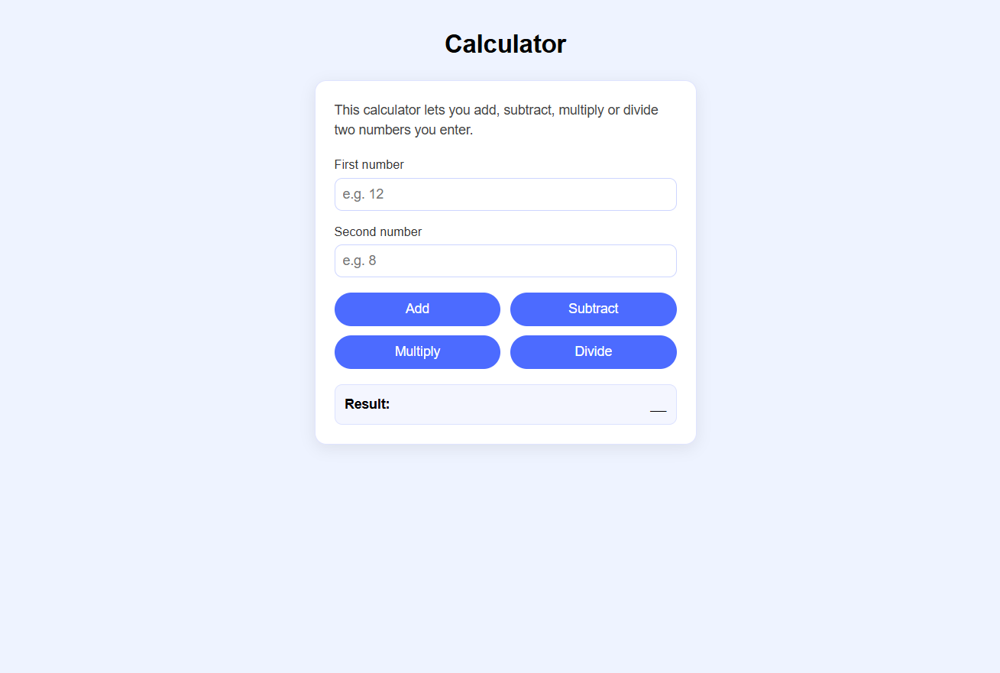
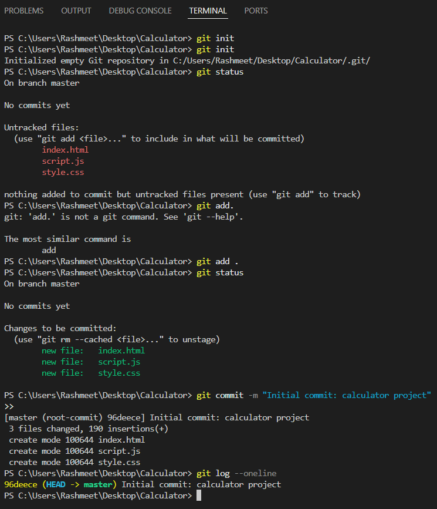
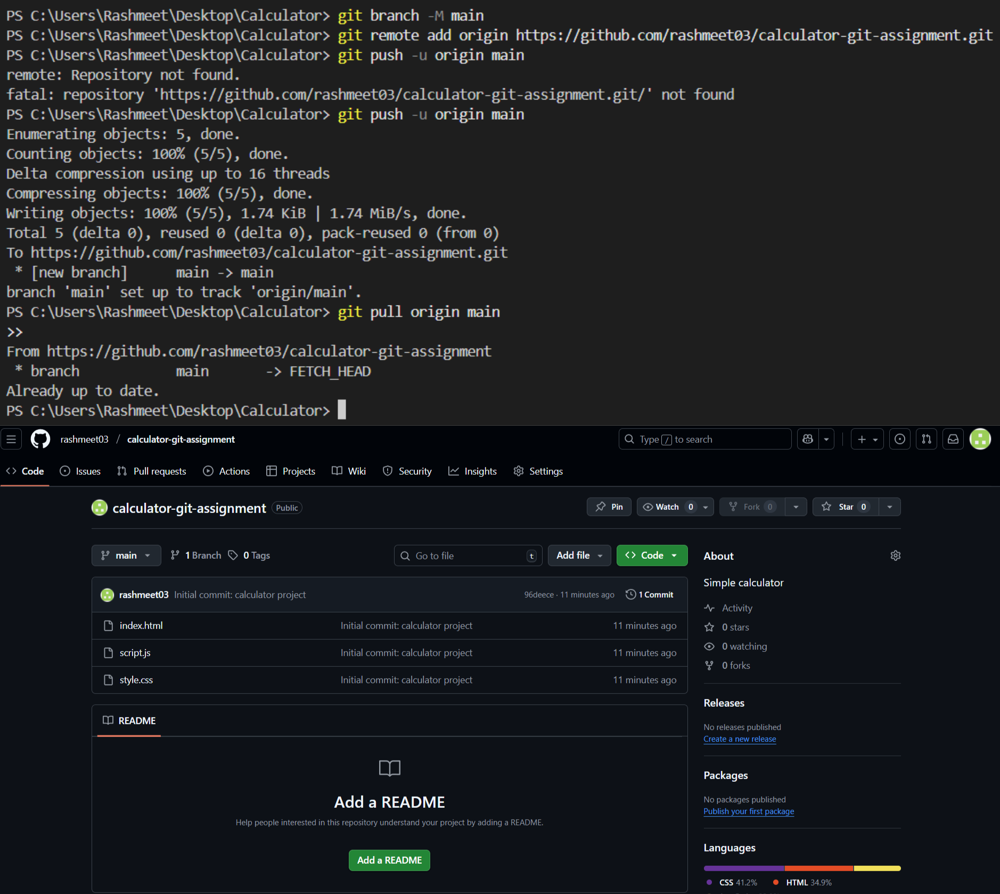
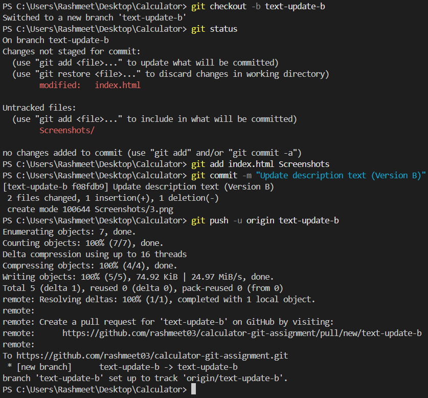

# Calculator Project – Git & GitHub Version Control Assignment

## 1. Project Overview

This project is a simple web-based calculator built using **HTML**, **CSS** and **JavaScript**.

The primary goal of this assignment is not the calculator itself, but to demonstrate my understanding and practical usage of **Git** and **GitHub**, including:

- Initializing a repository  
- Making meaningful commits  
- Working with branches  
- Merging branches  
- Intentionally creating a merge conflict  
- Manually resolving the merge conflict  
- Pushing all changes to GitHub  

## 2. Project Screenshot



## 3. Repository Setup

### Initializing Git

The local Git repository was initialized and the project files were committed.

```bash
git init
git status
git add .
git commit -m "Initial commit: calculator project"
```



## 4. Connecting to Github

The local repository was then connected to my remote GitHub repository, and the initial code was pushed.

```bash
git branch -M main
git remote add origin <repo-link>
git push -u origin main
git pull origin main
```



## 5. Creating Branches & Making Changes

Two feature branches were created:

- text-update-a
- text-update-b
  
Both branches intentionally edited the same line inside index.html to produce a merge conflict later.

### 5.1 Branch: text-update-a

```bash
git checkout -b text-update-a
# Edited index.html
git add index.html
git commit -m "Update description text (version A)"
git push -u origin text-update-a
```


### 5.2 Branch: text-update-b

```bash
git checkout main
git checkout -b text-update-b
# Edited the SAME line in index.html
git add index.html
git commit -m "Update description text (version B)"
git push -u origin text-update-b
```



## 6. Merging Branches

### 6.1 Merging Branch A into Main (Successful)

```bash
git checkout main
git merge text-update-a
git push
```


### 6.2 Merging Branch B into Main (Conflict)

```bash
git merge text-update-b
```

.png)

## 7. Resolving the Merge Conflict

```bash
git diff
# manually resolved conflict in index.html
git add index.html
git commit -m "Resolve merge conflict in description text"
git push
```


## 8. Git log after Merge Resolution

Complete commit history.

```bash
git log --oneline --graph --all
```


